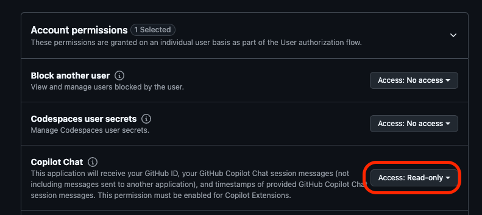
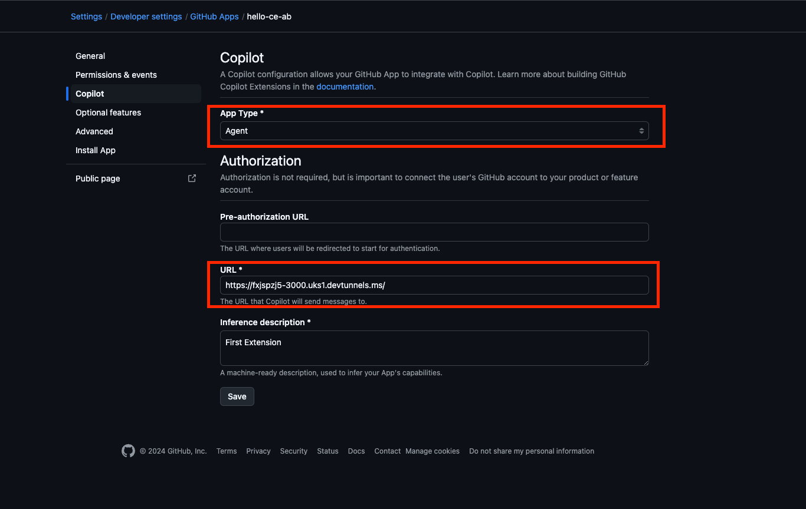
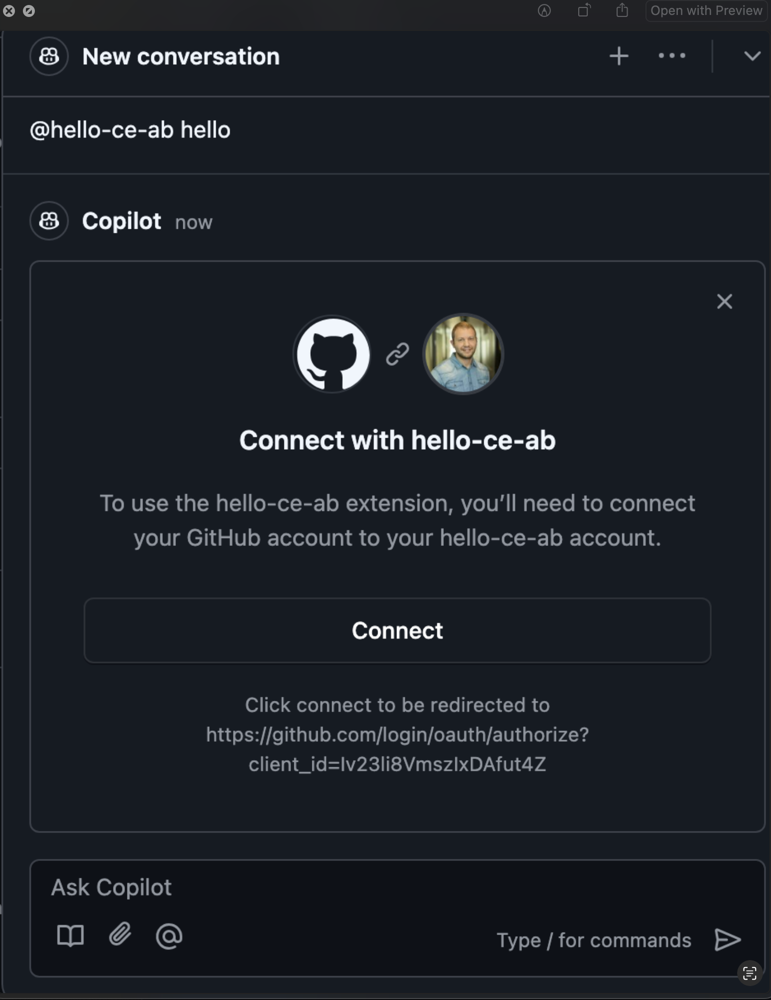

This is a [Next.js](https://nextjs.org) project bootstrapped with [`create-next-app`](https://nextjs.org/docs/app/api-reference/cli/create-next-app).

## Getting Started

First, run the development server:

```bash
npm run dev
# or
yarn dev
# or
pnpm dev
# or
bun dev
```

Open [http://localhost:3000](http://localhost:3000) with your browser to see the result.

# App Description

Introducing GitHub Copilot for WSC, your dedicated NBA companion! GC brings you live NBA results and a unique feature: concise summaries of press conferences and post-game insights. Stay updated with key takeaways, player quotes, and team strategies, all in one place.

With real-time updates and customizable notifications, GC is perfect for fans who want the latest NBA action and insider perspectives on each game’s impact and team dynamics.

# Instructions

## Task 1 - Copilot Sport Application with GitHub Copilot

1. **Imagine you are a new developer that hired to developer team, you need to explore the project and understand the main components**

   - Open a GitHub platform and access your repository
   - Press on GitHub Copilot icon to open a chat
   - Explore the app by asking a questions like:
      - Can you tell me about this repository? 
      - What framework the repository using? 
      - Where the api routes handled out ?  
      - Which API routes the repository includes ?
  
2.  **Clone the repository to your local environment**
    - Open the repository in VSCode IDE.
    - Open the terminal -> View -> Terminal.
    - Install the npm packages - in the root app folder run ```npm install``` in the terminal to install all necessary packages
    - Test the app by running ```npm run dev```
  
3. **Role Prompting:**
   GitHub Copilot Chat role prompting is a feature that allows developers to define a specific role for Copilot, guiding it to provide more relevant and context-aware assistance. By setting a role prompt, you outline your development goals, project context, and specific tasks, so Copilot tailors its suggestions, code snippets, and guidance to better match your needs. This makes Copilot’s responses more effective, particularly in complex projects or when working with specialized tools or frameworks.
   - Open GitHub Copilot Chat 
   - Prompt: 
   ```
   You are a developer working on a project using Next.js 14. You should be familiar with modern React practices, Next.js’s routing and app directory structure, API routes, and state management. Your tasks involve building efficient, scalable, and user-friendly applications with a focus on performance and responsiveness.
    Responsibilities:
    - UI Components: Build reusable, accessible, and responsive UI components using the latest Next.js conventions and best practices.
    - API Integration: Set up API routes, handle data fetching with SWR or other libraries, and optimize for performance.
    - Optimized Routing: Implement dynamic and nested routing, leveraging Next.js 14 features for route groups, layouts, and parallel routes.
    - Performance Optimization: Use Next.js optimizations, such as lazy loading and server-side rendering, to ensure fast loading and seamless user experiences.
    - Debugging & Testing: Use GitHub Copilot to generate code suggestions, debug issues, and write tests. Familiarity with testing libraries like Jest and React Testing Library is expected.
    
    Goals with GitHub Copilot Chat:

    - Code Assistance: Use Copilot to suggest improvements, refactor code, and speed up repetitive tasks.
    - Documentation: Generate documentation for components and API routes to ensure maintainability.
    - Error Resolution: Ask Copilot for troubleshooting advice or assistance with specific Next.js 14 features or configurations.
    - Optimization Suggestions: Seek suggestions for optimizing components, reducing bundle size, and improving server and client performance.
    ```

4. **Explore NextJS technology with GitHub Copilot participants**
   - In VSCode Open GitHub Copilot Chat
   - Enter the prompts: 
      - ```@github #web How do I create an API route in Next.js 14?```
      - ```@github #web What are Server Actions in Next.js 14?```
      - ```@github #web How does the routing system work in Next.js 14?```
      - ```@github #web How to create a ui component in Next.js 14?```  
   > @Github provides the ability to search within your repository or across the web using Bing search integration. Feel free to ask additional questions to deepen your understanding of Next.js 14 technology.

5. **Custom instructions** 
   You can enhance Copilot's chat responses by providing it with contextual details about your team's workflow, tools, or project specifics. Instead of manually including this context in every chat query, you can create a custom instructions file that automatically incorporates this information with every chat request.
   - In the root of your repository, create a file named ```.github/copilot-instructions.md```
     Create the .github directory if it does not already exist.
   - Add natural language instructions to the file, in Markdown format.
     Whitespace between instructions is ignored, so the instructions can be written as a single paragraph, each on a new line, or separated by blank lines for legibility
   - Instructions: 
     - ```For API routes, use Next.js 14's enhanced API route capabilities. Aim for suggestions that optimize data fetching from our backend services, like fetching game data and user statistics, while keeping it secure and performant.```
     - ```Always include comments with code suggestions.```
     - ```Incorporate error handling in all suggestions, with clear messaging for potential issues and recovery steps to ensure a robust and user-friendly application```


6. **Add Comments to Code:** 
   One of the common frustrations for developers is documenting their code properly, but don’t worry—Copilot is here to help!:
   - Open /src/api/nba-results/route.ts
   - Select the entire function, then press cmd+i on MacOS or ctrl+i on Windows. Next, type /doc.
    > GitHub Copilot will generate a documentation-style function declaration.
   - You can also use Copilot Chat to generate additional documentation. Open GitHub Copilot Chat and enter a prompt: ```Add comments to my code```
   - Add /docs and comments to other api routes
  
7. **Fix your code with GitHub Copilot**
   GitHub Copilot assists in fixing code errors by analyzing context to suggest corrections, improving code accuracy and reducing debugging time. It quickly identifies and offers solutions for syntax errors, logic issues, and common mistakes.
   - In the website's UI, navigate to the errors page at http://localhost:3000/errors
   - You will see an error displayed both on the website's UI and in the VSCode console.
   - In the Console Mark The Error and press right key in the mouse then choose the Copilot -> Explain this
   - Please fix the error and refresh the page, component location: /app/(dashboard)/errors/page.tsx
   - Once you've fixed the error, enhance the component's style by selecting the form, pressing Ctrl + I on Windows or Cmd + I on MacOS, and asking Copilot to improve the style using TailwindCSS.
   - See the results.

8. **GitHub Copilot Code Reviews**
   GitHub Copilot can review your code and provide feedback. Where possible, Copilot's feedback includes suggested changes which you can apply with a couple of clicks.
   - Open the /app/(dashboard)/errors/page.tsx file 
   - In MacOS press cmd + shift + p / in Windows press ctrl + shift + p to open the command pallette and prompt: GitHub Copilot: Review and comment
   - GitHub Copilot will suggest code improvements, which you can choose to accept, reject, or skip to move on to the next suggestion. You'll also find the complete suggestions in the comments section.

9.  **Generate Unit Tests using GitHub Copilot**
   Test-driven development and unit test creation aren't always prioritized by development teams. However, GitHub Copilot can significantly reduce the effort required for these tasks by automatically generating unit tests.
   - Open the coaches.py file located in the /flask directory at the root of the repository.
   - The file contains a simple Flask API route that returns a list of NBA coaches.
   - To run the app just run ```python coaches.py``` - You can test the api by GET request to http://localhost:8080/api/coaches

10. **Lets Create a Player info feature, Under lib folder there is a a file called player-info.ts with nba player stats, you need to build an api route and react component based on player stats using file attach option in the chat, the route already exists under /src/app/api/player-info/route.ts**
   - In github copilot chat press the attach file and attach the player-info.ts - prompt: `Using the player-info, create a GET request to retrieve the player's id, name, team, weigh, height and position`, insert the content to /src/app/api/player-info/route.ts
   - You can test your api route with GET request: http://localhost:3000/api/player-info
   - Open /app/(dashboard)/player-info/page.tsx
   - Open the chat and prompt: `Using the player-info route (#file:route.ts ), retrieve and display a list of players along with their stats. Use Tailwind CSS classes and ShadCN components to present each player in a separate card, display only the name, team, weight, height and position.`
   - Open the http://localhost:3000/players-info and see the results, refactor the code if needed. 
  

10. **Add a Press conferences summarization feature using Azure OpenAI GPT-4o model**
   Your goal is to summarize each of the press conferences that located in localhost:3000/press-conferences page.
   - Open /src/app/api/summarize/route.ts file 
   - You have a boilerplate for POST request
     - The request need to receives a transcription from the request
     - use openai sdk with Azure implementation to create a summarization 
     - use github copilot prompt engineering techniques like Input/Output Format -> Error Handling -> Control the Structure of the code in the file declaration - to help copilot to provide a better suggestion
     - in .env.local file we already configured an Azure OpenAI endpoint and the key - use the process.env.NEXT_PUBLIC_AZURE_OPENAI_ENDPOINT for the endpoint, process.env.NEXT_PUBLIC_AZURE_OPENAI_KEY for the KEY, use api version - 2024-10-01-preview, and deployment name: gpt-4o
   - Test the api route with POST request to http://localhost:3000/api/summarize - make sure to path the transcription into the request for test to work
   -  Open GitHub Copilot chat 
      -  prompt: ```#codebase Where is the implementation of the Press Conference Card located in my code?``` the #codebase Searches through the codebase and pulls out relevant information for the query.
      -  Once GitHub Copilot locates the file, click on the file name in the chat to be redirected to it.
      -  The "Summarize with AI" button is already in your code but isn’t functional yet. Your goal is to use Copilot to create a handler function that calls the API route, summarizes the transcript, and displays it at the bottom of the card. As a bonus, try implementing a loading state to disable the button and show a loading indicator while the summary is being generated.
      > You can implement the feature using either chat or inline code.
      - Test the ui feature. 


11. **GitHub Copilot Extensions**
   Through a growing partner ecosystem, Copilot Extensions enables developers to build and deploy to the cloud in their natural language with their preferred tools and services, all without leaving the IDE or GitHub.com. With Copilot and now Copilot Extensions, developers can stay in the flow longer, uplevel their skills, and innovate faster.
   - In VSCode please open the GitHub Copilot Chat 
   - Type the prompt: ```Generate a Dockerfile to containerize a Next.js 14 application``` and see the results
   - Now do the same using Docker extension ```@Docker Generate a Dockerfile to containerize a Next.js 14 application``` and test the results 
   - The Docker extension offers additional capabilities for working with containers, including features such as:
     - Learn about containerization
     - Generate the correct Docker assets for your project
     - Open a pull request with the assets to save you time
     - Find project vulnerabilities with Docker Scout


## Task 2 - Build your first GitHub Copilot Extension
Building your first GitHub Copilot extension involves creating custom features that enhance the capabilities of GitHub Copilot, tailored to specific tasks or workflows.
1. Navigate to the /custom-copilot-extension folder.
2. In the CLI, execute the command ```npm init -y``` to initialize an npm project.
3. Create index.js file 
4. Open GitHub Copilot chat and prompt: ```Add an ES module; create server using http; handle the get method```
5. Insert the code to your index.js file 
6. Install npm copilot extensions package: ```npm i @copilot-extensions/preview-sdk``` 
7. You can follow the SDK github repo for more details: https://github.com/copilot-extensions/preview-sdk.js
8. Customize your code to use the package ( example output ):
   ```javascript
   import http from 'http';
   import { createTextEvent, createDoneEvent } from "@copilot-extensions/preview-sdk"

   const server = http.createServer((req, res) => {
   if (req.method === 'GET') {
      res.writeHead(200, { 'Content-Type': 'text/plain' });
      res.end('Hello, world!');
   } else {
      res.write(createTextEvent("Hello, world!"));
      res.write(createTextEvent("This is my first Copilot extensions!"));
      res.end(createDoneEvent());
   }
   });

   const PORT = 3000;
   server.listen(PORT, () => {
   console.log(`Server is running on port ${PORT}`);
   });
   ```
9. Run ```npm start``` 
10. In VSCode cli open PORTS TAB and forward the a port
    
11. Set the port to be publicly accessible.
12. Go to your GitHub platform 
13. Open settings
    
14. Select Developer settings
15. Under GitHub Apps Click Create GitHub App: 
    - Enter github app name ( must be unique )
    - Describe your extension app
    - Home page url: http://github.com
    - Callback url: https://github.com
    - Remove checkbox for Expire user authorization tokens
    - Remove checkbox for Webhook -> Active
    - Allow read-only permission to Account permissions -> Copilot Chat -> Access: Read-only
        
    - Click Create GitHub App
16.  After the creation completed press Copilot Tab
    - Choose App Type: Agent
    - Url: Provide the url from port forwarding configuration in your idea cli
      
    - Result:
    
17. Make sure your app is running
18. In GitHub platform open the Github copilot chat and type @<your-extension-name> hello
19. Authorize the app
    
20. Try the extension
21. Bonus: Leverage your previous application task to call one of the API endpoints and return the results within your Copilot extension.
    
     


